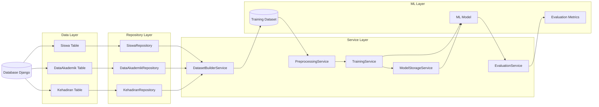

```mermaid
flowchart LR

DB[(Database Django)]

subgraph Data Layer
    DA[DataAkademik Table]
    KH[Kehadiran Table]
    S[Siswa Table]
end

subgraph Repository Layer
    StudentRepo[SiswaRepository]
    AkademikRepo[DataAkademikRepository]
    KehadiranRepo[KehadiranRepository]
end

subgraph Service Layer
    DatasetService[DatasetBuilderService]
    PreprocessService[PreprocessingService]
    TrainingService[TrainingService]
    EvaluationService[EvaluationService]
    ModelService[ModelStorageService]
end

subgraph ML Layer
    Dataset[(Training Dataset)]
    Model[ML Model]
    Metrics[Evaluation Metrics]
end

DB --> S
DB --> DA
DB --> KH

S --> StudentRepo
DA --> AkademikRepo
KH --> KehadiranRepo

StudentRepo --> DatasetService
AkademikRepo --> DatasetService
KehadiranRepo --> DatasetService

DatasetService --> Dataset
Dataset --> PreprocessService
PreprocessService --> TrainingService
TrainingService --> Model
Model --> EvaluationService
EvaluationService --> Metrics

TrainingService --> ModelService
ModelService --> Model
```